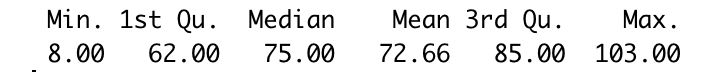
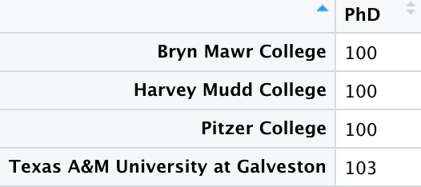
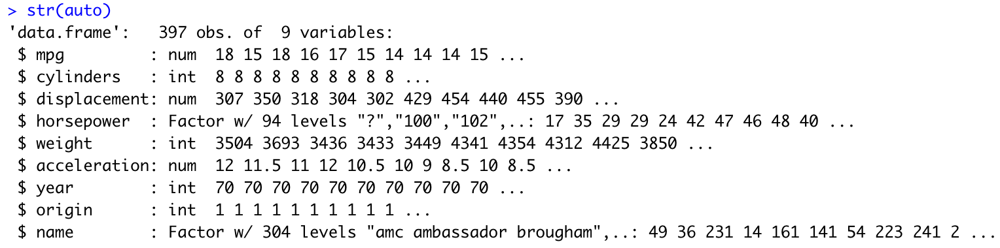
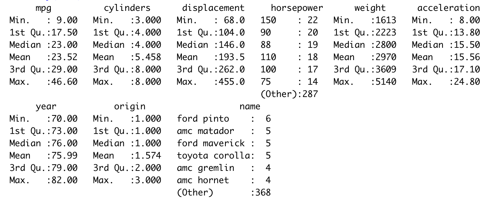
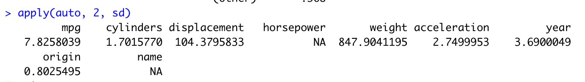

# Chapter 2 Written Exercise Notes

## Key Definitions

f represents the functional relationship between the independentant variables and the dependent variable. In statistical learning
we try to estimate f as best as we can thus creating a model that helps us to predict or infer about X and Y.

e is the random error term. It represents the irreducible error part of a model which is independent of the predictors and has a
mean of 0 (values can have a positive or negative effect). Basically, e is the unmeasured variables that may be useful in predicting
Y.

Euclidean distance is the distance between two points in an ordinary straight line. You can compute this using the Pythagorean
theorem.

## Question 1

a)

When sample size, n, is extremely large and the number of predictors, p, is small, we would expect the performance of
the estimate of f to be better if it was flexible.

The reason is because we have a huge sample, n, so the risk of overfitting the data can be seen to be lower.

b)

When n is low and predictors, p, is extremely large, an inflexible (parametric) model may be better.

The reason is that when n is small then a non-parametric model may overfit the data. We also have a high selection of p so it
would help to simplify the model through parametric statistics.

c)

When the relationship between p and y is highly non-linear, then a non-parametric model is best because it would be difficult
to create an appropriate functional form for the estimate f.

d)

When the variance of the error terms, i.e. Var(e) is extremely high, then non-parametric methods are a worse choice.

The reason is because flexible methods will fit to these irreducible errors and noise, thus increasing the variance of predicted
y.

## Question 5

The advantages and disadvantages of a flexible (non-parametric) model for regression and classification problems.

Advantages:

1. Potential to accurately fit a wider range of situations for f and fit different data well. Therefore, flexible models are a
better option for prediction problems.

2. Less bias compared to a parametric model as it does not make assumptions about the relationship between the predictors and
response.

Disadvantages:

1. They do not reduce the problem of estimating f to a small number of parameters. As a result, far more observations are required
and parametric models may be more suitable for simplifying inference problems.

2. There is also the risk of overfitting data and to minimise this, an extremely large amount of observations is required.

3. Although non-parametric models have less bias, they can have much higher variance compared to parametric models. This is because
non-parametric models try to fit all data points whereas a parametric model like a linear model makes assumptions about the
relationship between the predictors and the response.

## Question 6

Parametric Statistical Learning

Parametric statistical learning makes assumptions on the functional form or shape of f. Linear models are a typical example of
parametric statistical learning because they assume that there is a linear relationship, i.e. a change in one variable always results
in a defined corresponding change. Basically, parametric statistics assumes that sample data come from a population that can be
adequately modelled by a probability distribution that has a fixed set of parameters. Probability distribution being a mathematical
function that provides the probabilities of occurence of different possible outcomes in an experiment.

The disadvantage of course, is that the model can be far from the true form of f, making our estimates poor. 

Non-parametric Statistical Learning

Non-parametric methods do not make explicit assumptions about the functional form of f. Instead, they seek an estimate of f that
gets as close to the data points as possible without being too rough or wiggly.

## Question 7

Suppose we wish to use this data set to make a prediction for Y when X1 = X2 = X3 = 0 using K-nearest neighbors.

a)

| Observation | X1 | X2 | X3 | Y     | Distance       |
|-------------|----|----|----|-------|----------------|
| 1           | 0  | 3  | 0  | Red   | 3              |
| 2           | 2  | 0  | 0  | Red   | 2              |
| 3           | 0  | 1  | 3  | Red   | sqrt(10) ~ 3.2 |
| 4           | 0  | 1  | 2  | Green | sqrt(5) ~ 2.2  |
| 5           | -1 | 0  | 1  | Green | sqrt(2) ~ 1.4  |
| 6           | 1  | 1  | 1  | Red   | sqrt(2) ~ 1.7  |

b) What is our prediction for when K = 1?

The closest single (K = 1 so we pick the closest one) observation set to X1 = X2 = X3 = 0 is observation 5 as it has the lowest distance
which gives the prediction of "Green".

c) What is our prediction for when K = 3?

We pick the three closest observations which are: 2, 5 and 6. We get the predictions, "Red", "Green" and "Red". So the probability
of 2/3 for "Red" thus that is our prediction for when K = 3.

d) If the Bayes decision boundary in this problem is highly non-linear, then would we expect the best value for K to be large or small?

The Bayes Decision Boundary is where the probability for a prediction is exactly 50%. The Bayes Classifier is determined by this boundary
and all observations on one side of the boundary will be assigned a fixed classification and observations on the other side will be assigned
the other classification. This works because the Bayes theorem assumes that we know the conditional probability distribution of Y given X.

When it comes to KNN and a non-linear Bayes Decision Boundary, we would expect a smaller K to allow flexibility. If the boundary was highly
linear then we would use a higher K to better fit the linear boundary line.

# Chapter 2 Applied Exercise Notes (R Studio)

## Question 8

a)

Change the working directory to where the data file is. Then load the College.csv file with the following command:

college = read.csv("College.csv")

b)

Use the:

fix(data set variable)

function to open the R Data Editor so you can make quick data changes. 

The function:

rownames(college) = college[, 1]

creates another column called row.names and gives a name for each row of data. The names are taken from the first column data of the college
data set. When it comes to data frames, the square brackets represent [row_number, col_number] and they do not start from 0 unlike arrays.
Call the fix(college) function to make the changes to the data frame. R will not try to perform calculations on row.names.

The function:

college = college[, -1]

Will remove the first non-row.names column from the data frame. So you should notice that the university column is gone and the first column
is Private column instead. Basically, if you use a minus sign in the squared brackets, then you are saying remove the first column in this
case.

Note! You can also specify a range of columns, for instance the first 10 columns by inserting this in the square brackets 1:10.

c)

i)

The summary function:

summary(data set variable)

gives you a numerical summary of the data set. So it provides numbers like min/max values, first and third quartile values, mean and median.

ii)

A scatter plot is a graph in which the values of two variables are plotted along two axes. The pattern reveals correlations if any.

A scatter plot matrix is a table of scatter plots. Each plot is small so that many plots can fit on a page. They are a great way to roughly
determine if you have a linear correlation between multiple variables.

We can use the pairs function to create a scatter plot matrix:

pairs(college[, 1:10])

this command creates a scatter plot matrix using the first ten variables/columns of our college data.

-ScatterPlotMatrix.png)

iii)

Use the plot function:

plot(x-axis data, y-axis data, x-axis label, y-axis label, main title)

plot(college$Private, college$Outstate, xlab = "Private University", ylab ="Out of State tuition in USD", main = "Outstate Tuition Plot")

to plot side by side box plots of Outstate versus Private. You can use the $ sign to get the data by column name.

-BoxPlot.png)

iv)

Data binning, bucketing, is a data pre-processing method used to minimize the effects of small observation errors. The original data values
are divided into small intervals known as bins and then they are replaced by a general value calculated for that bin. This has a smoothing
effect on the input data and may also reduce the chances of overfitting in case of small datasets

There are 2 methods of dividing data into bins:

1. Equal Frequency Binning : bins have equal frequency.
2. Equal Width Binning : bins have equal width with a range of each bin are defined as [min + w], [min + 2w] …. [min + nw] where w = (max – min)/(no of bins).

Equal Frequency Binning Example

Input: [5, 10, 11, 13, 15, 35, 50, 55, 72, 92, 204, 215]

Output:
[5, 10, 11, 13]
[15, 35, 50, 55]
[72, 92, 204, 215]

Equal Width Binning Example

Input: [5, 10, 11, 13, 15, 35, 50, 55, 72, 92, 204, 215]

Output:
[10, 11, 13, 15, 35, 50, 55, 72]
[92]
[204]

Use binning when you have such a large number of individual graphic elements in the chart that you cannot distinguish them.

Back to the question...

Create a new qualitative variable, called “Elite”, by binning the “Top10perc” variable. We are going to bin them by dividing universities into two groups based on whether
or not the proportion of students coming from the top 10% of their high school classes exceeds 50 %.

Steps:

1. Use the rep function which replicates the value in the first parameter by the amount of times in the second parameter:

Elite = rep("No", nrow(college))

so the above replicates "No" by the number of rows in the college data set and stores in the Elite variable as a vector.

2. We now want to convert a number of the "No" values in Elite to "Yes". We the get the amount to convert by finding the number of values in the Top10perc column in college
that are higher than 50:

Elite[college$Top10perc > 50] = "Yes"

3. We now want to convert the Elite variable as a Factor. Factors in R are the data objects which are used to categorise the data and store it as levels, levels being the two
numbers we use to represent a category, for example 0 for No and 1 for Yes. We do this with the following function:

Elite = as.factor(Elite)

The above should give you something like this:

"No", "Yes": 1 1 1 1 2 2 1 ...

4. The final step is to create a new data frame and assign it to college. 

college = data.frame(college, Elite)

The above function just uses the column names of college and also takes Elite as the last column name and appends it to college. However, you can also usually set the column names
like so:

data.frame("SN" = 1:2, "Age" = c(21,15), "Name" = c("John","Dora"))

the column names being SN, Age and Name, whilst the others are the column values.

Use the summary(Elite) function to see how many elite universities there are:

| Yes | No  |
|-----|-----|
| 78  | 699 |

Now use the plot() function to produce side-by-side boxplots of “Outstate” versus “Elite”:

plot(college$Elite, college$Outstate, xlab = "Elite", ylab = "Outstate", main = "Outstate versus Elite")

-BoxPlot.png)

v)

Use the par function to divide the print window into four regions so that four plots can be made simultaneously:

par(mfrow=c(2,2))  

"Bins" in a Histogram are the x-axis intervals, i.e. how we classify the data into intervals:

-Histograms.png)

so from the above image, we can see that the Grad Rate Histogram has 11 bins of widths of 10.

vi)

summary(college$PhD)

Looking at the results above we see that some universities have a 103% faculty rate with PhDs. This does not sound right so to identify which universities have this:

## Question 9

a)

To find out which predictors in a data frame are qualitative and quantiative, we use the str command:

str(auto)

the str stands for structure and it will output the structure of a data set from which you can see which are quanlitative and quantitative:

We can see that only horsepower and name are qualitative.

b)

To get the range from a vector or predictor values, you can use the range function:

range(auto$mpg)

and this will give the min and max values from the vector.

However, like before, we can just use the summary function:

summary(auto)

c)

To get the standard deviation of a column or predictor, we can use the following:

sd(auto$mpg)

To get the standard deviations of all columns:

apply(data frame, margin, sd)

Margin is refers to the margins of a matrix or data frame, so 1 means all rows and 2 means all columns:

apply(auto, 2, sd)

As you can see the qualitative predictors just have NA.